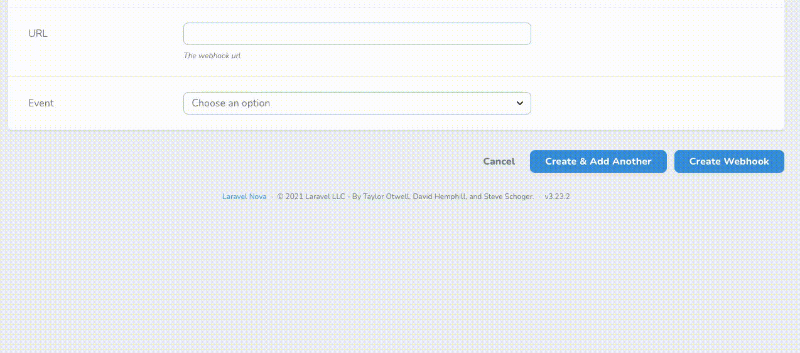

# Codesnippet field for Nova

This packages adds a `Codesnippet` custom field for use in your Nova applications. The Codesnippet field is an explainer
field suited to provide in-context information during resource creation and update.

Simply add a Codesnippet field, per the usual Nova format:

```php
Codesnippet::make('example-code', '
    public function example(){
        return "Whatever works!";
    }
')
```

Optionally, the field can also be displayed conditionally. This can be done by supplying the literal field name and value to check.

```php
Codesnippet::make('example-code', '
    public function example(){
        return "Whatever works!";
    }
', 'event', 'DonationCreated')
```
# Demonstration


## Thanks to

This packages dependes on the `Prism` and `vue-code-highlight` packages for syntax highlighting.
All credits in that regard go to the maintainers of those packages.